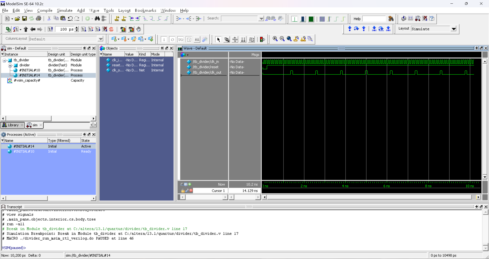

# FPGA 技术及应用 实验-1

> **实验组员：** 史胤隆、彭淳毅

## 实验目的

针对 Verilog HDL 中分频器进行练习.

## 实验内容

1. 设计一个占空比 50% 的模 12 分频器, 并设计测试程序, 进行功能仿真, 将仿真波形图整理入实验报告;
1. 设计一个占空比任意的模 12 分频器, 并设计测试程序, 进行功能仿真, 将仿真波形图整理入实验报告;
1. 设计一个占空比为 50% 的模 8 分频器, 将 Verilog 代码和仿真波形图整理入实验报告.

## 实验代码及仿真波形图

### 1. 占空比 50% 的模 12 分频器

- **divider.v**

  ```Verilog
  module divider(
      input clk_in, reset,
      output reg clk_out
  );
      reg[3:0] cnt;
      parameter div = 12;
      always @(posedge clk_in or negedge reset) begin
          if (!reset) begin
              cnt <= 0;
              clk_out <= 0;
          end
          else begin
              if (cnt == div / 2 - 1) begin
                  cnt <= 0;
                  clk_out <= ~clk_out;
              end
              else cnt <= cnt + 1'b1;
          end
      end
  endmodule

  ```

- **tb_divider.v**

  ```Verilog
  `timescale 10ps/1ps
  module tb_divider();
      reg clk_in, reset;
      wire clk_out;
      divider divider(
          .clk_in(clk_in),
          .reset(reset),
          .clk_out(clk_out)
      );
      initial begin
          clk_in = 0;
          forever #5 clk_in = ~clk_in;
      end
      initial begin
                  reset = 0;
          #20     reset = 1;
          #1000   $stop;
      end
  endmodule

  ```

- **仿真波形图**

  

### 2. 占空比任意的模 12 分频器

- **divider.v**

  ```Verilog
  module divider(
      input clk_in, reset,
      output reg clk_out
  );
      reg[3:0] cnt;
      parameter div = 12;
      always @(posedge clk_in or negedge reset) begin
          if (!reset) begin
              cnt <= 0;
              clk_out <= 0;
          end
          else begin
              if (cnt == div - 1) begin
                  cnt <= 0;
                  clk_out <= 1;
              end
              else begin
                  cnt <= cnt + 1'b1;
                  clk_out <= 0;
              end
          end
      end
  endmodule

  ```

- **tb_divider.v**

  ```Verilog
  `timescale 10ps/1ps
  module tb_divider();
      reg clk_in, reset;
      wire clk_out;
      divider divider(
          .clk_in(clk_in),
          .reset(reset),
          .clk_out(clk_out)
      );
      initial begin
          clk_in = 0;
          forever #5 clk_in = ~clk_in;
      end
      initial begin
                  reset = 0;
          #20     reset = 1;
          #1000   $stop;
      end
  endmodule

  ```

- **仿真波形图**

  

### 3. 占空比为 50% 的模 8 分频器

- **divider.v**

  ```Verilog
  module divider(
      input clk_in, reset,
      output reg clk_out
  );
      reg[2:0] cnt;
      always @(posedge clk_in or negedge reset) begin
          if (!reset) begin
              cnt <= 0;
              clk_out <= 0;
          end
          else begin
              cnt <= cnt + 1;
              clk_out <= cnt[2];
          end
      end
  endmodule

  ```

- **tb_divider.v**

  ```Verilog
  `timescale 10ps/1ps
  module tb_divider();
      reg clk_in, reset;
      wire clk_out;
      divider divider(
          .clk_in(clk_in),
          .reset(reset),
          .clk_out(clk_out)
      );
      initial begin
          clk_in = 0;
          forever #5 clk_in = ~clk_in;
      end
      initial begin
                  reset = 0;
          #20     reset = 1;
          #1000   $stop;
      end
  endmodule

  ```

- **仿真波形图**

  

## 实验结果及总结
