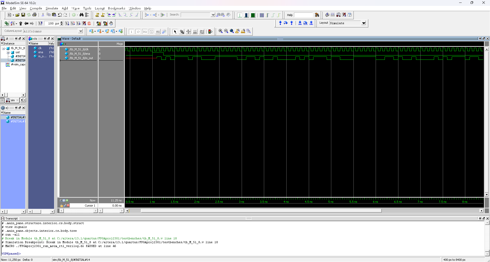
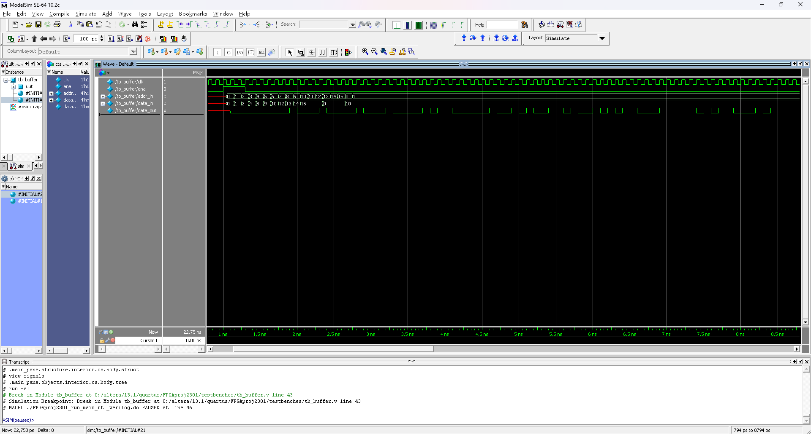
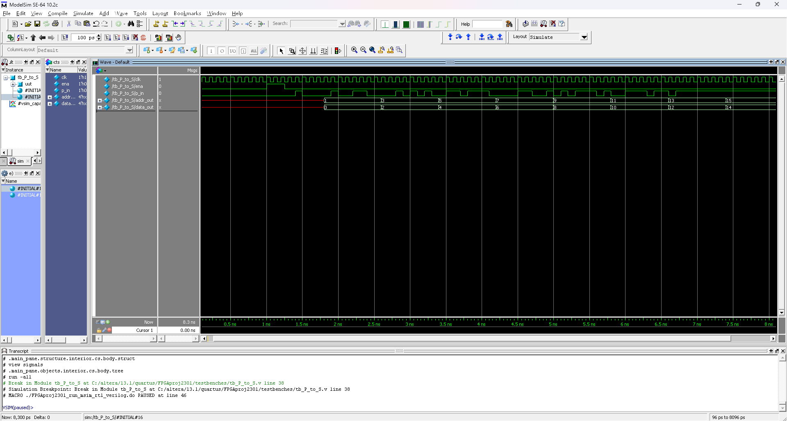

# FPGA 技术及应用 竞赛-1

> **实验组员：** 史胤隆、彭淳毅

## 实验目的

深入理解层次化设计, 强化实验设备使用.

## 实验内容

完成简易数据传输加密处理电路设计, 进行功能仿真, 将 Verilog 代码和仿真波形图整理入实验报告.

## 设计结构

### 简要结构图


### 完整结构图


<div STYLE="page-break-after: always;"></div>

## 完整代码和测试波形

### 顶层模块

- **FPGAproj2301.v**

  ```verilog
  module FPGAproj2301 (
      input clk, ena,
      output [3:0] V1_addr, V1_data,
      output V2, V3, V4,  // debug only
      // output data_out,    // debug only
      output V5_clk,
      output [3:0] V5_addr, V5_data
  );
      // wire V2, V3, V4;        // non debugging only
      wire V1_ena, V3_ena;    // non debugging only
      data_source ds (
          .clk(clk),
          .ena(ena),
          .ena_out(V1_ena),
          .addr_out(V1_addr),
          .data_out(V1_data)
      );
      M_51_8 SSRG1 (
          .clk(clk),
          .ena(ena),
          .m_out(V2)
      );
      encrypt_and_transmit enc (
          .clk(clk),
          .ena(V1_ena),
          .key(V2),
          .addr_in(V1_addr),
          .data_in(V1_data),
          .ena_out(V3_ena),
          // .data_out(data_out),  // debug only
          .data_enc(V3)
      );
      M_51_8 SSRG2 (
          .clk(clk),
          .ena(ena),
          .m_out(V4)
      );
      recept_and_decrypt dec (
          .clk(clk),
          .ena(V3_ena),
          .data_enc(V3),
          .key(V4),
          .clk_div(V5_clk),
          .addr_out(V5_addr),
          .data_out(V5_data)
      );
      RAM ram (
          .clk(V5_clk),
          .addr_in(V5_addr),
          .data_in(V5_data)
      );
  endmodule
  
  ```


### 二层模块

- **data_source.v**

  ```verilog
  module data_source (
      input clk, ena,
      output reg ena_out,
      output [3:0] addr_out, data_out
  );
      reg flag;
      reg [3:0] cnt, out;
      initial begin
          flag <= 1'b0;
          cnt <= 4'b0000;
          ena_out <= 1'b0;
      end
      always @ (posedge ena) flag <= 1'b1;
      always @ (posedge clk) if (flag | ena) begin
          ena_out <= 1'b1;
          out <= cnt;
          cnt <= cnt + 1'b1;
      end
      assign addr_out = out;
      assign data_out = out;
  endmodule

  ```

- **buffer.v**

  ```verilog
  module buffer (
      // output reg flag,                // debug only
      // output reg [6:0] cnt,           // debug only
      input clk, ena,
      input [3:0] addr_in, data_in,
      output reg ena_out, data_out
  );
      reg flag;               // non debugging only
      reg [6:0] cnt;          // non debugging only
      reg [7:0] data [15:0];
      initial begin
          flag <= 1'b0;
          cnt <= 7'b0000000;
          ena_out <= 1'b0;
      end
      always @ (posedge ena) flag = 1'b1;
      // // allow read-during-write behavior
      // always @ (posedge clk) if (flag) begin
      //     if (!cnt[6:4]) data[cnt[3:0]] = {addr_in, data_in};
      //     data_out = data[cnt[6:3]][cnt[2:0]];
      //     cnt = cnt + 1'b1;
      //     ena_out = 1'b1;
      // end
      // avoid read-during-write behavior
      always @ (posedge clk) if (flag) begin
          if (!cnt) data_out <= data_in[0];
          else data_out <= data[cnt[6:3]][cnt[2:0]];
      end
      always @ (posedge clk) if (flag) begin
          if (!cnt[6:4]) data[cnt[3:0]] = {addr_in, data_in};
          cnt = cnt + 1'b1;
          ena_out = 1'b1;
      end
  endmodule

  ```

- **M_51_8.v**

  ```verilog
  module M_51_8 (
      input clk, ena,
      output reg m_out
  );
      reg flag;
      reg [4:0] shift_reg;
      initial begin
          flag <= 1'b0;
          shift_reg <= 5'b10101;
      end
      always @ (posedge ena) flag = 1'b1;
      always @ (posedge clk) if (flag) begin
          shift_reg[0] <= shift_reg[1] ^ shift_reg[4];
          {m_out, shift_reg[4:1]} <= shift_reg[4:0];
      end
  endmodule

  ```

- **encrypt_and_transmit.v**

  ```verilog
  module encrypt_and_transmit (
      input clk, ena, key,
      input [3:0] addr_in, data_in,
      // output data_out,  // debug only
      output ena_out, data_enc
  );
      wire data_out;      // non debugging only
      buffer buffer (
          .clk(clk),
          .ena(ena),
          .addr_in(addr_in),
          .data_in(data_in),
          .ena_out(ena_out),
          .data_out(data_out)
      );
      assign data_enc = data_out ^ key;
  endmodule

  ```

- **recept_and_decrypt.v**

  ```verilog
  module recept_and_decrypt (
      input clk, ena, data_enc, key,
      output clk_div,
      output [3:0] addr_out, data_out
  );
      wire data_in;
      assign data_in = data_enc ^ key;
      P_to_S p_to_s (
          .clk(clk),
          .ena(ena),
          .p_in(data_in),
          .addr_out(addr_out),
          .data_out(data_out)
      );
      divider_8 div (
          .clk(clk),
          .ena(ena),
          .clk_out(clk_div)
      );
  endmodule

  ```

- **RAM.v**

  ```verilog
  module RAM (
      input clk,
      input [3:0] addr_in, data_in
  );
      reg [3:0] data [15:0];
      always @ (posedge clk) data[addr_in] = data_in;
  endmodule
  
  ```


### 三层模块

- **P_to_S.v**

  ```verilog
  module P_to_S (
      input clk, ena, p_in,
      output reg [3:0] addr_out, data_out
  );
      reg flag;
      reg [2:0] cnt;
      reg [7:0] shift_reg;
      initial begin
          flag <= 1'b0;
          cnt <= 3'b000;
      end
      always @ (posedge ena) flag <= 1'b1;
      always @ (posedge clk) if (flag | ena) begin
          if (!cnt) {addr_out, data_out} <= shift_reg;
          shift_reg[6:0] <= shift_reg[7:1];
          shift_reg[7] <= p_in;
          cnt <= cnt + 1'b1;
      end
  endmodule

  ```

- **divider_8.v**

  ```verilog
  module divider_8 (
      input clk, ena,
      output reg clk_out
  );
      reg flag;
      reg [1:0] cnt;
      initial begin
          flag <= 1'b0;
          cnt <= 2'b00;
          clk_out <= 1'b0;
      end
      always @ (posedge ena) flag = 1'b1;
      always @ (posedge clk) if (flag) begin
          if (!cnt) clk_out <= !clk_out;
          cnt <= cnt + 1'b1;
      end
  endmodule
  
  ```


### TestBenches

- **tb_FPGAproj2301.v**

  ```verilog
  `timescale 10ps/1ps
  module tb_FPGAproj2301 ();
      reg clk, ena;
      wire [3:0] V1_addr, V1_data;
      wire V2, V3, V4;    // debug only
      // wire data_out;      // debug only
      wire V5_clk;
      wire [3:0] V5_addr, V5_data;
      FPGAproj2301 uut (
          .clk(clk),
          .ena(ena),
          .V1_addr(V1_addr),
          .V1_data(V1_data),
          .V2(V2),        // debug only
          .V3(V3),        // debug only
          .V4(V4),        // debug only
          // .data_out(data_out),    // debug only
          .V5_clk(V5_clk),
          .V5_addr(V5_addr),
          .V5_data(V5_data)
      );
      initial begin
                      clk = 1'b1;
          forever #5  clk = ~clk;
      end
      initial begin
                  ena = 1'b0;
          #97     ena = 1'b1;
          #25     ena = 1'b0;
          #2000   $stop;
      end
  endmodule

  ```

- **tb_data_source.v**

  ```verilog
  `timescale 10ps/1ps
  module tb_data_source ();
      reg clk, ena;
      wire [3:0] addr_out, data_out;
      data_source uut (
          .clk(clk),
          .ena(ena),
          .addr_out(addr_out),
          .data_out(data_out)
      );
      initial begin
          clk = 1'b1;
          forever #5 clk = ~clk;
      end
      initial begin
          ena = 1'b0;
          #97 ena = 1'b1;
          #25 ena = 1'b0;
          #1000 $stop;
      end
  endmodule

  ```

- **tb_buffer.v**

  ```verilog
  `timescale 10ps/1ps
  module tb_buffer ();
      reg clk, ena;
      reg [3:0] addr_in, data_in;
      wire data_out;
      // wire flag;              // debug only
      // wire [5:0] cnt;         // debug only
      buffer uut (
          // .flag(flag),        // debug only
          // .cnt(cnt),          // debug only
          .clk(clk),
          .ena(ena),
          .addr_in(addr_in),
          .data_in(data_in),
          .data_out(data_out)
      );
      initial begin
          clk = 1'b1;
          forever #5 clk = ~clk;
      end
      initial begin
                                                          ena = 1'b0;
          #100                                            ena = 1'b1;
          #5      addr_in = 4'b0000;  data_in = 4'b0000;
          #10     addr_in = 4'b0001;  data_in = 4'b0001;
          #10     addr_in = 4'b0010;  data_in = 4'b0010;
          #5                                              ena = 1'b0;
          #5      addr_in = 4'b0011;  data_in = 4'b0100;
          #10     addr_in = 4'b0100;  data_in = 4'b1000;
          #10     addr_in = 4'b0101;  data_in = 4'b1001;
          #10     addr_in = 4'b0110;  data_in = 4'b1010;
          #10     addr_in = 4'b0111;  data_in = 4'b1100;
          #10     addr_in = 4'b1000;  data_in = 4'b1101;
          #10     addr_in = 4'b1001;  data_in = 4'b1110;
          #10     addr_in = 4'b1010;  data_in = 4'b1111;
          #10     addr_in = 4'b1011;  data_in = 4'b1111;
          #10     addr_in = 4'b1100;  data_in = 4'b1111;
          #10     addr_in = 4'b1101;  data_in = 4'b0000;
          #10     addr_in = 4'b1110;  data_in = 4'b0000;
          #10     addr_in = 4'b1111;  data_in = 4'b0000;
          #10     addr_in = 4'b0000;  data_in = 4'b1010;
          #10     addr_in = 4'b0001;  data_in = 4'b1010;
          #2000   $stop;
      end
  endmodule

  ```

- **tb_M_51_8.v**

  ```verilog
  `timescale 10ps/1ps
  module tb_M_51_8 ();
      reg clk, ena;
      wire m_out;
      M_51_8 uut (
          .clk(clk),
          .ena(ena),
          .m_out(m_out)
      );
      initial begin
          clk = 1'b1;
          forever #5 clk = ~clk;
      end
      initial begin
          ena = 1'b0;
          #100 ena = 1'b1;
          #25 ena = 1'b0;
          #1000 $stop;
      end
  endmodule

  ```

- **tb_P_to_S.v**

  ```verilog
  `timescale 10ps/1ps
  module tb_P_to_S ();
      reg clk, ena, p_in;
      wire [3:0] addr_out, data_out;
      P_to_S uut (
          .clk(clk),
          .ena(ena),
          .p_in(p_in),
          .addr_out(addr_out),
          .data_out(data_out)
      );
      initial begin
          clk = 1'b1;
          forever #5 clk = ~clk;
      end
      initial begin
              p_in = 1'b0; ena = 1'b0;
        #100  p_in = 1'b0; ena = 1'b1;
        #10   p_in = 1'b0;
        #10   p_in = 1'b0;
        #5                 ena = 1'b0;
        #5    p_in = 1'b0;
        #10   p_in = 1'b1; #10 p_in = 1'b0; #10 p_in = 1'b0; #10 p_in = 1'b0;
        #10   p_in = 1'b0; #10 p_in = 1'b1; #10 p_in = 1'b0; #10 p_in = 1'b0;
        #10   p_in = 1'b1; #10 p_in = 1'b1; #10 p_in = 1'b0; #10 p_in = 1'b0;
        #10   p_in = 1'b0; #10 p_in = 1'b0; #10 p_in = 1'b1; #10 p_in = 1'b0;
        #10   p_in = 1'b1; #10 p_in = 1'b0; #10 p_in = 1'b1; #10 p_in = 1'b0;
        #10   p_in = 1'b0; #10 p_in = 1'b1; #10 p_in = 1'b1; #10 p_in = 1'b0;
        #10   p_in = 1'b1; #10 p_in = 1'b1; #10 p_in = 1'b1; #10 p_in = 1'b0;
        #10   p_in = 1'b0; #10 p_in = 1'b0; #10 p_in = 1'b0; #10 p_in = 1'b1;
        #10   p_in = 1'b1; #10 p_in = 1'b0; #10 p_in = 1'b0; #10 p_in = 1'b1;
        #10   p_in = 1'b0; #10 p_in = 1'b1; #10 p_in = 1'b0; #10 p_in = 1'b1;
        #10   p_in = 1'b1; #10 p_in = 1'b1; #10 p_in = 1'b0; #10 p_in = 1'b1;
        #10   p_in = 1'b0; #10 p_in = 1'b0; #10 p_in = 1'b1; #10 p_in = 1'b1;
        #10   p_in = 1'b1; #10 p_in = 1'b0; #10 p_in = 1'b1; #10 p_in = 1'b1;
        #10   p_in = 1'b0; #10 p_in = 1'b1; #10 p_in = 1'b1; #10 p_in = 1'b1;
        #10   p_in = 1'b1; #10 p_in = 1'b1; #10 p_in = 1'b1; #10 p_in = 1'b1;
        #100  $stop;
      end
  endmodule

  ```

- **tb_divider_8.v**

  ```verilog
  `timescale 10ps/1ps
  module tb_divider_8();
      reg clk, ena;
      wire clk_out;
      divider_8 uut(
          .clk(clk),
          .ena(ena),
          .clk_out(clk_out)
      );
      initial begin
          clk = 1'b1;
          forever #5 clk = ~clk;
      end
      initial begin
          ena = 1'b0;
          #100 ena = 1'b1;
          #25 ena = 1'b0;
          #1000 $stop;
      end
  endmodule
  
  ```

<div STYLE="page-break-after: always;"></div>

### 测试波形

- **FPGAproj2301**

  

  

- **data_source**

  

  <div STYLE="page-break-after: always;"></div>

- **buffer**

  

  

- **M_51_8**

  

  <div STYLE="page-break-after: always;"></div>

- **P_to_S**

  

  

- **divider_8**

  
